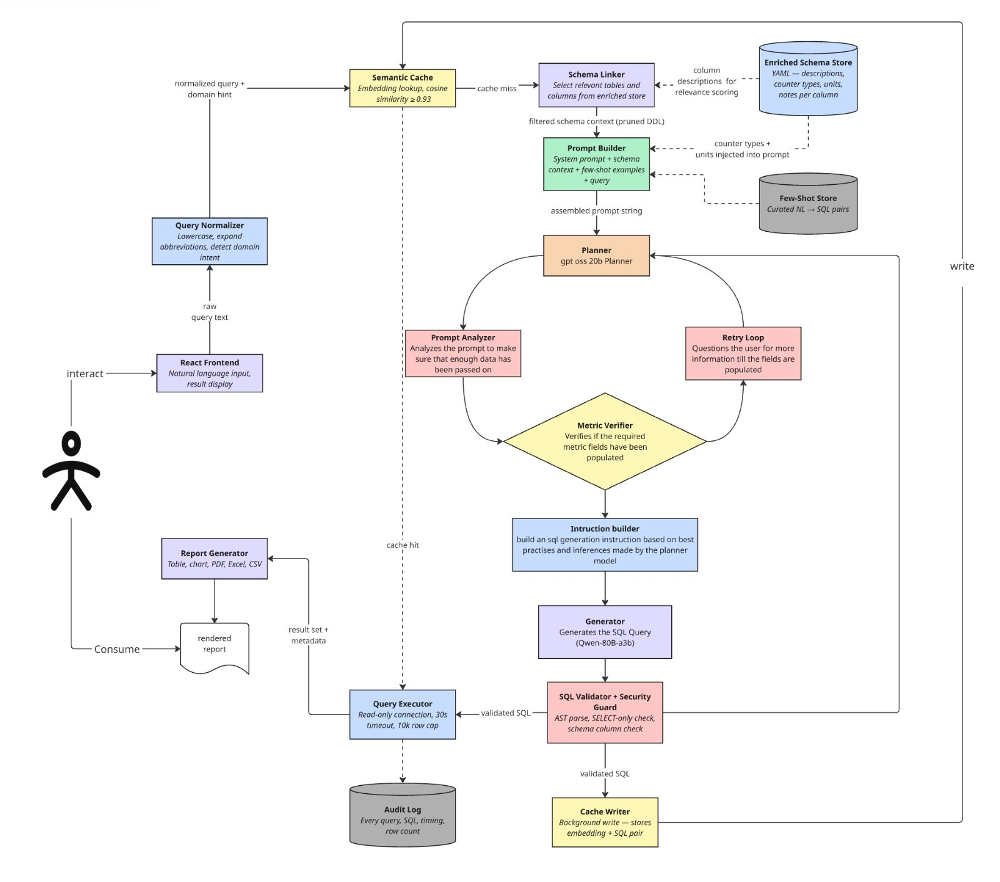

# QueryCraft

> Natural Language to SQL Performance Report Generator for HPE Nonstop Systems

QueryCraft lets analysts query HPE Nonstop server performance data using plain English. Type a question, get back a SQL query, results table or chart, and a downloadable report — no SQL knowledge required.

**Stack:** FastAPI · React · PostgreSQL · Google Gemini API / NVIDIA NIM (Qwen, GPT-OSS) · Ollama · ChromaDB  
**Database:** `macht413`, `D1`, `D2` schemas · 11 tables · Real HPE Nonstop measurement data

---

## Architecture



The pipeline splits SQL generation across two specialized models. A lightweight **Planner** (GPT-OSS 20B) reads the pruned schema context and produces a structured intent spec; a **Metric Verifier** checks that every required metric/column is populated before generation. If not, the **Retry Loop** questions the user for the missing piece rather than hallucinating. Only once the intent is complete does the **Instruction Builder** hand off to the **Generator** (Qwen3-Next 80B) to emit final SQL. Every generated statement is then AST-parsed and security-checked before it can touch a read-only DB connection.

---

## What's New
- **Two-Model Planner + Generator Architecture**: A lightweight **Planner** model (default `openai/gpt-oss-20b`) analyzes the query and builds a structured intent spec. A larger **Generator** model (default `qwen/qwen3-next-80b-a3b-instruct`) emits the final SQL. Both are routed through NVIDIA NIM; Gemini remains available as a single-model fallback.
- **Prompt Analyzer + Retry Loop**: A Metric Verifier inspects the planner's spec and, if required fields are missing, the system asks the user a targeted follow-up instead of hallucinating.
- **Multi-Database Manager**: Switch between target databases (`macht413`, `D1`, `D2`) dynamically from the frontend. The `SchemaLinker` filters out columns not present in the chosen target database to eliminate hallucinations. Upload/delete databases via the UI.
- **Dockerized**: Full `docker compose` setup for backend + frontend. See [Run with Docker](#run-with-docker-alternative-to-steps-35).
- **Dark/Light Themes + HPE Green Styling**: Theme toggle in the top bar.
- **Auto-Caching on Export + Robust Metrics Extraction**: Successful queries are embedded and cached in the background; IPU/utilization formulas are extracted deterministically.
- **HPE Direct-Join Syntax**: Validated against HPE's preferred time-series correlation logic (direct `LEFT JOIN`s over CTE aggregations).

---

## Prerequisites

Install these before anything else:

| Tool | Version | Notes |
|------|---------|-------|
| PostgreSQL | Latest stable | Must be running locally on port 5432 |
| Python | 3.10+ | |
| Node.js | 18+ LTS | |
| Git | Any | |
| Docker + Docker Compose | Latest stable | Optional — only if using the [Docker setup](#run-with-docker-alternative-to-steps-35) |

You also need at least one LLM provider key:
- **Google Gemini API key** (single-model mode) — get one free at https://aistudio.google.com/app/apikey
- **NVIDIA NIM API key** (recommended, two-model Planner + Generator mode) — https://build.nvidia.com/

---

## Step 1 — Clone the repo

```bash
git clone https://github.com/Surjithk73/HPE_49.git
cd HPE_49
```

---

## Step 2 — Set up the PostgreSQL database

### 2.1 Create the database, schema, and roles

Connect to PostgreSQL as the superuser and run:

```sql
-- Create database
CREATE DATABASE querycraft_db;

-- Create schema owner role
CREATE ROLE nonstop_measure WITH LOGIN PASSWORD 'your_owner_password';

-- Connect to the new database, then run:
\c querycraft_db

-- Create schema
CREATE SCHEMA macht413 AUTHORIZATION nonstop_measure;

-- Create read-only app role
CREATE ROLE querycraft_user WITH LOGIN PASSWORD 'your_readonly_password';
GRANT CONNECT ON DATABASE querycraft_db TO querycraft_user;
GRANT USAGE ON SCHEMA macht413 TO querycraft_user;
GRANT SELECT ON ALL TABLES IN SCHEMA macht413 TO querycraft_user;
ALTER DEFAULT PRIVILEGES IN SCHEMA macht413 GRANT SELECT ON TABLES TO querycraft_user;

-- Set safety timeouts
ALTER ROLE querycraft_user SET statement_timeout = '30s';
ALTER ROLE querycraft_user SET idle_in_transaction_session_timeout = '60s';
```

Or use the automated script (fill in your postgres password first):

```bash
# Edit POSTGRES_PASSWORD, OWNER_PASSWORD, READONLY_PASSWORD in the script first
python backend/setup_scripts/setup_database_auto.py
```

### 2.2 Create the tables

```bash
psql -U postgres -d querycraft_db -f backend/setup_scripts/create_tables.sql
```

All column types are correctly defined in this file — no post-load fixes required.

### 2.3 Load the CSV data

```bash
# Edit POSTGRES_PASSWORD in the script first, then:
python backend/setup_scripts/load_csv_data_auto.py
```

Or manually via psql (update the paths to match your system):

```sql
\copy macht413.cpu   FROM 'C:/path/to/HPE_49/measurefiles/cpucsv'   WITH (FORMAT csv, HEADER true, NULL '');
\copy macht413.disc  FROM 'C:/path/to/HPE_49/measurefiles/disccsv'  WITH (FORMAT csv, HEADER true, NULL '');
\copy macht413.dfile FROM 'C:/path/to/HPE_49/measurefiles/dfilecsv' WITH (FORMAT csv, HEADER true, NULL '');
\copy macht413.dopen FROM 'C:/path/to/HPE_49/measurefiles/dopencsv' WITH (FORMAT csv, HEADER true, NULL '');
\copy macht413.file  FROM 'C:/path/to/HPE_49/measurefiles/filecsv'  WITH (FORMAT csv, HEADER true, NULL '');
\copy macht413.ossns FROM 'C:/path/to/HPE_49/measurefiles/ossnscsv' WITH (FORMAT csv, HEADER true, NULL '');
\copy macht413.proc  FROM 'C:/path/to/HPE_49/measurefiles/proccsv'  WITH (FORMAT csv, HEADER true, NULL '');
\copy macht413.tmf   FROM 'C:/path/to/HPE_49/measurefiles/tmfcsv'   WITH (FORMAT csv, HEADER true, NULL '');
\copy macht413.udef  FROM 'C:/path/to/HPE_49/measurefiles/udefcsv'  WITH (FORMAT csv, HEADER true, NULL '');
\copy macht413.sqlp  FROM 'C:/path/to/HPE_49/backend/data/D2/sqlpcsv'  WITH (FORMAT csv, HEADER true, NULL '');
\copy macht413.sqls  FROM 'C:/path/to/HPE_49/backend/data/D2/sqlscsv'  WITH (FORMAT csv, HEADER true, NULL '');
```

### 2.4 Verify

```sql
SELECT 'cpu'   AS tbl, COUNT(*) FROM macht413.cpu
UNION ALL SELECT 'disc',  COUNT(*) FROM macht413.disc
UNION ALL SELECT 'dfile', COUNT(*) FROM macht413.dfile
UNION ALL SELECT 'dopen', COUNT(*) FROM macht413.dopen
UNION ALL SELECT 'file',  COUNT(*) FROM macht413.file
UNION ALL SELECT 'ossns', COUNT(*) FROM macht413.ossns
UNION ALL SELECT 'proc',  COUNT(*) FROM macht413.proc
UNION ALL SELECT 'tmf',   COUNT(*) FROM macht413.tmf
UNION ALL SELECT 'udef',  COUNT(*) FROM macht413.udef
UNION ALL SELECT 'sqlp',  COUNT(*) FROM macht413.sqlp
UNION ALL SELECT 'sqls',  COUNT(*) FROM macht413.sqls;
```

Expected total: **212,689+ rows** across all 11 tables.

---

## Run with Docker (alternative to Steps 3–5)

If you have **Docker** and **Docker Compose** installed, you can build and run both the backend and frontend in containers instead of installing Python/Node dependencies manually. You still need PostgreSQL set up and loaded (Steps 1–2 above) — the containers connect to a database running on your host.

### D.1 — Configure the backend `.env`

```bash
cp backend/.env.example backend/.env
```

Fill in `backend/.env` as described in [Step 3](#step-3--configure-the-backend), **but set `DB_HOST` to `host.docker.internal`** so the container can reach the PostgreSQL instance running on your host:

```env
DB_HOST=host.docker.internal
```

Everything else (`DB_USER`, `DB_PASSWORD`, etc.) is the same as the manual setup.

> Make sure PostgreSQL is configured to accept connections from the Docker bridge network (listen on all interfaces / `host.docker.internal`), not only `localhost`.

### D.2 — Build and start the containers

From the repo root:

```bash
docker compose up --build
```

This builds two images and starts them:

| Service | Container port | Host URL |
|---------|----------------|----------|
| `backend` (FastAPI + Uvicorn) | 8000 | http://localhost:8000 |
| `frontend` (Vite dev server)  | 5173 | http://localhost:5173 |

The backend image bakes in the `BAAI/bge-large-en-v1.5` embedding model at build time, so the **first build takes several minutes** (downloads ~1.3GB). Subsequent builds are cached. Source directories are bind-mounted, so hot reload (Uvicorn `--reload` and Vite HMR) works while the containers run.

**Open:** http://localhost:5173

### D.3 — Verify and manage

```bash
curl http://localhost:8000/api/health
```

Expect the same JSON response shown in [Step 6](#step-6--verify-everything-is-working).

Common commands:

```bash
docker compose up --build -d     # run in the background (detached)
docker compose logs -f backend   # follow backend logs
docker compose down              # stop and remove the containers
docker compose build --no-cache  # rebuild from scratch
```

> If `db_connected` is `false`, confirm `DB_HOST=host.docker.internal` in `backend/.env` and that PostgreSQL accepts remote connections. On Linux, `host.docker.internal` is provided by the `extra_hosts` mapping already configured in `docker-compose.yml`.

Once running with Docker, you can skip Steps 3–5 below (they cover the manual, non-Docker setup) and jump to [Using QueryCraft](#using-querycraft).

---

## Step 3 — Configure the backend

```bash
cp backend/.env.example backend/.env
```

Open `backend/.env` and fill in your values:

```env
# PostgreSQL — use the read-only role created in Step 2
DB_HOST=localhost
DB_PORT=5432
DB_NAME=querycraft_db
DB_USER=querycraft_user
DB_PASSWORD=your_readonly_password
DB_ADMIN_PASSWORD=your_admin_password

# Allowed DB users (comma-separated) for the Query Executor
ALLOWED_DB_USERS=querycraft_user

# LLM provider: 'gemini' (default) or 'ollama' for fully-offline generation
LLM_PROVIDER=gemini

# Gemini API — get key from https://aistudio.google.com/app/apikey
GEMINI_API_KEY=your_gemini_api_key
GEMINI_MODEL=gemini-3.1-flash-lite

# NVIDIA NIM API — required for the two-model Planner + Generator pipeline
NVIDIA_API_KEY=your_nvidia_api_key

# Model roles. Names containing qwen/gpt/openai are routed to NVIDIA NIM;
# otherwise they fall back to Gemini. Both default to GEMINI_MODEL if unset.
PLANNER_MODEL=openai/gpt-oss-20b
SQL_GENERATOR_MODEL=qwen/qwen3-next-80b-a3b-instruct

# App settings (defaults are fine)
MAX_ROWS=10000
QUERY_TIMEOUT_SECONDS=120
CACHE_SIMILARITY_THRESHOLD=0.95
AUDIT_LOG_PATH=audit/query_log.db
SCHEMA_YAML_PATH=schema_store/enriched_schema.yaml
FEW_SHOTS_PATH=few_shots/examples.yaml
```

---

## Step 4 — Install dependencies

**Backend:**
```bash
cd backend
pip install -r requirements.txt
```

> First run will download the `BAAI/bge-large-en-v1.5` embedding model (~1.3GB) from HuggingFace. This only happens once — it's cached locally after that. The API is available immediately while the model loads in the background.

**Frontend:**
```bash
cd frontend
npm install
```

---

## Step 5 — Run the system

Open two terminals:

**Terminal 1 — Backend:**
```bash
cd backend
uvicorn main:app --reload --port 8000
```

The API is available within ~1 second. The embedding model loads in the background — cache hits are available once `[Cache] Embedding model ready` appears in the terminal (usually within 15 seconds).

**Terminal 2 — Frontend:**
```bash
cd frontend
npm run dev
```

**Open:** http://localhost:5173

---

## Step 6 — Verify everything is working

```bash
curl http://localhost:8000/api/health
```

Expected response:
```json
{
  "status": "ok",
  "db_connected": true,
  "cache_ready": true,
  "cache_model_ready": true,
  "llm_model": "gemini-3.1-flash-lite",
  "cache_entries": 0,
  "schema_tables": 11
}
```

If `db_connected` is `false`, check your `.env` credentials and that PostgreSQL is running.  
If `cache_model_ready` is `false`, the embedding model is still loading — wait a few seconds and retry.

---

## Using QueryCraft

### Example queries to try

**Simple:**
- `Show average CPU busy time per CPU`
- `Show disk read and write counts per device`
- `List all process names with their CPU usage`
- `Show transaction backout counts`

**Complex:**
- `Identify the top 5 most CPU-intensive processes and show their CPU usage percentage, memory pages, messages sent and received, and the overall CPU utilization for that CPU at the same time interval`
- `Analyze disk I/O hotspots by calculating cache hit ratios and queue times per device`
- `Show system health by aggregating CPU, disk, and process metrics grouped by timestamp`

### Exporting results

After running a query, use the Download buttons in the UI to export as:
- **CSV** — full dataset
- **Excel** — formatted with bold headers
- **PDF** — includes query text, SQL, and data table (capped at 500 rows; use CSV/Excel for full data)

### Cache management

Repeated or semantically similar queries are served from the local ChromaDB cache (0.95 cosine similarity threshold) — no Gemini API call needed. Manage the cache at http://localhost:5173/cache

---

## Project structure

```
HPE_49/
├── backend/
│   ├── main.py                        # FastAPI app, all routes
│   ├── config.py                      # Env var loader
│   ├── requirements.txt
│   ├── .env.example                   # Copy to .env and fill in
│   ├── pipeline/
│   │   ├── normalizer.py              # Query normalization + domain detection
│   │   ├── cache.py                   # ChromaDB semantic cache
│   │   ├── embeddings.py              # BGE embedding wrapper
│   │   ├── schema_linker.py           # TF-IDF table/column selection
│   │   ├── schema_loader.py           # Multi-DB schema loader
│   │   ├── prompt_builder.py          # LLM prompt assembly
│   │   ├── few_shot_retriever.py      # NL→SQL few-shot selection
│   │   ├── planner.py                 # Planner model + Metric Verifier + Retry Loop
│   │   ├── intent_spec.py             # Structured intent spec used by the planner
│   │   ├── sql_generator.py           # Instruction Builder → Generator model
│   │   ├── model_provider.py          # Routes model names to Gemini / NVIDIA NIM
│   │   ├── llm_engine.py              # Gemini engine
│   │   ├── ollama_engine.py           # Offline Ollama engine
│   │   ├── validator.py               # SQLGlot security + correctness checks
│   │   ├── executor.py                # psycopg2 connection pool + execution
│   │   └── report_generator.py        # CSV / Excel / PDF export
│   ├── schema_store/
│   │   └── enriched_schema.yaml       # Full schema with column descriptions and correct types
│   ├── few_shots/
│   │   └── examples.yaml              # NL→SQL examples for the LLM
│   ├── audit/
│   │   └── query_log.py               # SQLite audit log
│   ├── setup_scripts/                 # One-time DB setup utilities
│   └── tests/                         # Unit + integration tests
├── frontend/
│   └── src/
│       ├── pages/                     # Landing, Dashboard, CacheManagement, DatabaseManager, HowItWorks
│       ├── components/                # QueryInput, ResultsTable, ChartView, PromptDebugPanel, ThemeToggle, etc.
│       └── lib/api.ts                 # All API calls
├── architecture.jpeg                  # Pipeline diagram (referenced above)
├── measurefiles/                      # Source CSV data files (9 tables)
└── docs/
    ├── Project_Overview.md            # Full architecture + design decisions
    ├── NOTES.md                       # Known issues, gotchas, benchmarks
    ├── frequently_used_queries.md     # Reference examples
    └── plan.md                        # Original build plan (all phases complete)
```

---

## API reference

| Method | Endpoint | Description |
|--------|----------|-------------|
| `GET` | `/api/health` | System health check |
| `POST` | `/api/query` | Run a natural language query (Planner → Generator pipeline) |
| `POST` | `/api/query/start` | Start a planned query; may return follow-up questions from the Metric Verifier |
| `POST` | `/api/query/answer` | Supply the user's answer to a Retry Loop follow-up |
| `POST` | `/api/query/force` | Skip the Metric Verifier and force generation with the current spec |
| `POST` | `/api/query/edit` | Edit / re-run a previously generated SQL statement |
| `POST` | `/api/cancel` | Cancel an in-flight query |
| `POST` | `/api/sql` | Run a raw SQL query directly |
| `POST` | `/api/image-to-query` | Convert an uploaded chart/screenshot into a natural language query |
| `POST` | `/api/export` | Download results as CSV / Excel / PDF |
| `GET` | `/api/history` | Last 50 queries from audit log |
| `GET` | `/api/stats` | Analytics: hit rate, avg time, top domains |
| `GET` | `/api/schema` | Table names and column counts |
| `GET` | `/api/databases` | List configured target databases |
| `GET` | `/api/databases/details` | Row counts and metadata per target database |
| `DELETE` | `/api/databases/{target_db}` | Drop a target database |
| `POST` | `/api/upload-measure` | Upload a measurefile zip to create a new target database |
| `POST` | `/api/upload-measure/{target_db}/append` | Append measurefiles to an existing target database |
| `GET` | `/api/cache` | View cached query entries |
| `DELETE` | `/api/cache` | Clear all cache entries |
| `DELETE` | `/api/cache/query` | Delete a single cache entry |
| `POST` | `/api/cache/accept` | Manually cache a query/SQL pair |
| `GET` | `/api/cache/threshold` | Read current similarity threshold |
| `POST` | `/api/cache/threshold` | Update threshold at runtime |
| `GET` | `/api/model` | Read the active planner / generator model |
| `POST` | `/api/model` | Switch planner / generator model at runtime |

Interactive docs: http://localhost:8000/docs

---

## Troubleshooting

**Backend won't start**
- Check PostgreSQL is running: `pg_isready -h localhost -p 5432`
- Check all keys are set in `backend/.env`
- Check Python version: `python --version` (needs 3.10+)

**`db_connected: false` in health check**
- Verify `DB_USER`, `DB_PASSWORD`, `DB_NAME` in `.env`
- Test manually: `psql -U querycraft_user -d querycraft_db -h localhost`
- Make sure `querycraft_user` role was created and granted SELECT

**`cache_model_ready: false` in health check**
- The embedding model is still loading in the background — wait a few seconds and retry
- Queries will work immediately but won't benefit from cache hits until the model is ready

**LLM returns errors / no SQL generated**
- Check `GEMINI_API_KEY` and/or `NVIDIA_API_KEY` are valid and have quota remaining
- Verify `PLANNER_MODEL` / `SQL_GENERATOR_MODEL` names are spelled correctly (any name containing `qwen`/`gpt`/`openai` is routed to NVIDIA NIM)
- Check internet connection (Gemini / NVIDIA NIM are the only external calls)
- Look at backend terminal for the specific error

**"Please clarify …" follow-up prompts appear repeatedly**
- The Metric Verifier detected that a required field (e.g. a specific counter or grouping dimension) was not covered by the planner's spec. Answer the follow-up or rephrase the original question to include the missing dimension.

**Frontend shows "Backend unreachable"**
- Make sure backend is running on port 8000
- Check no firewall is blocking localhost:8000

**Embedding model download hangs on first start**
- Needs internet access on first run to download `BAAI/bge-large-en-v1.5` (~1.3GB)
- After first download it's cached at `~/.cache/huggingface/hub/` and works offline

---

## Security notes

- The app connects to PostgreSQL as `querycraft_user` — a **SELECT-only** role. It cannot write, modify, or delete any data.
- All generated SQL passes through a 7-layer validator (SQLGlot AST parsing) before execution. No raw user input ever reaches the database.
- `statement_timeout = 30s` is enforced at both the DB role level and the connection level.
- This is a **single-user local deployment** — there is no authentication, rate limiting, or encryption. Do not expose it on a public network.

---

## Strict Data Integrity Rules

As a core requirement for this project, the following guidelines **must never be violated**:
1. **Schema Integrity:** The backend database schema must strictly mirror the exact tables and columns provided by HPE. Do not modify, add, or alter any of these database structures.
2. **Examples Integrity:** The `examples.yaml` file acts as the official repository of frequently used queries provided by HPE. All queries MUST strictly adhere to the flat structures and specific mathematical formulas (e.g., `100*sum(val)/sum(delta_time)`, `concat()`) found in the HPE source examples. Do not introduce unsupported multi-table CTEs or complex joins beyond what HPE explicitly dictates.

---

*QueryCraft v1.0.0 — HPE NonStop Performance Report Generator*
